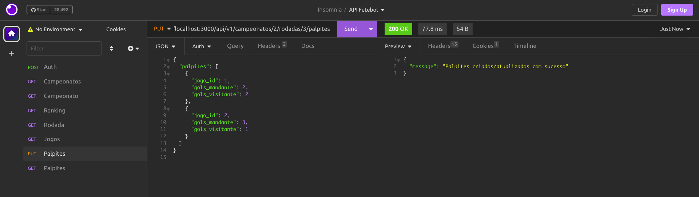
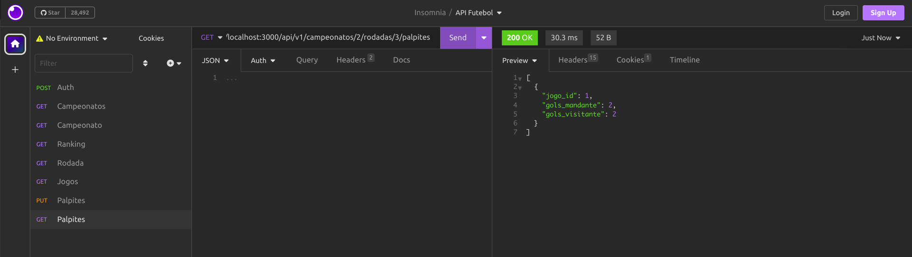
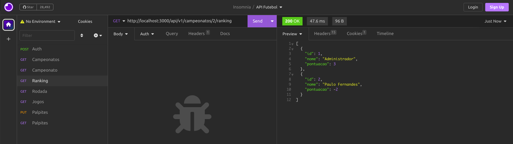

# Raro Bolão

Projeto iniciado durante a semana 13 da turma de Ruby on Rails - Raro Academy pelo professor Paulo Fernandes e continuado como exercício da semana citada, que teve "Rails API" como tema.

## Objetivos

Tendo como base o [enunciado do exercício](./.gitlab/enunciado.md), os objetos são:

- [x] Implementar rota de publicação dos palpites do usuário;
- [x] Implementar rota de ranking dos usuários;
- [x] Adicionar pontuação do usuário na rota de jogos
- [x] Atualizar a documentação do Swagger;
- [x] Garantir que a integração com a API Futebol crie ou atualize dados dos jogos, com placares e status de finalização
- [x] Garantir que a integração com a API Futebol crie ou atualize dados dos times

## Desenvolvimento

- O primeiro passo para iniciar a atividade foi realizar a autenticação na API. Esse processo foi realizado utilizando o [Insomnia](https://insomnia.rest/), passando a `authorization` no header da requisição. Foi utilizado o "frontend" da aplicação para criar campeonatos, competições, rodadas e jogos com o objetivo de testar as respostas devolvidas via json ao bater nas rotas da API.
  Construir o caminho das rotas até chegar em `palpites`ajudou no desenvolvimento da atividade e para isso foram criadas as actions `index` e `show`no `campeonatos_controller` e action `show` em `rodadas_controller`. E por fim, o controller de `palpites` foi criado de acordo com a documentação do [Swagger](https://swagger.io/) acrescentando a action `index`.

   
   

- Afim de exercitar foi também adiciona a rota de GET para palpites, que retorna todos os palpites de um usuário. Para isso foi criada a action `index` no controller de `palpites` e a rota foi adicionada no arquivo `routes.rb`.

   

- Para criar a rota de ranking foram criados métodos no model de Palpite para que fosse possível calcular a pontuação de cada usuário. Como no swagger a ordenação é feita por nome, e não havia esse atributo no model de Usuário, foi gerada uma nova migration para adicionar o atributo `nome` ao model de Usuário. Nesse mesmo model também foi implementado o método `pontuação` responsável por retornar a pontuação mapeando as rodadas, os jogos e utilizando os métodos criados no model de Palpite.

   

- Foi incluída na documentação do swagger as informações necessárias para incluir a pontuação do usuário na rota de jogos. No model de Jogo foram criados dois métodos, um para retornar a pontuação de acordo com os palpites e outro para salvá-los no banco de dados. Foi criado um novo atributo de pontuação na tabela de Palpites, pois conforme a aplicação for expandido, persistir esse dado pode ser uma boa estratégia.

- Para garantir que a integração com a API Futebol crie ou atualize dados dos jogos, com placares e status de finalização, foi criado um método no model de Jogo que recebe um hash com os dados do jogo e atualiza o placar e o status de finalização. Esse método foi chamado no método `salvar_jogos`. Além do método que é responsável por atualizar ou adicionar as equipes no banco de dados..

## Testes

- Para seguir o padrão do projeto iniciado durante as aulas, alguns testes foram implementados para garantir o bom funcionamento dos controllers adicionados e dos métodos incluídos a nivel de model.

# Setup

- Clone o repositório
- Instale as dependências com `bundle install`
- Adicione suas credenciais rodando o comando `EDITOR="code --wait" bin/rails credentials:edit --enviroment development`, nesse arquivo coloque:
  - jwt_secret_key: [uma chave secreta para o jwt](https://passwordsgenerator.net/)
  - api_futebol_api_key: [uma chave de acesso a API Futebol](https://www.api-futebol.com.br/)
- Crie o banco de dados com `rails db:create`
- Rode as migrações com `rails db:migrate`
- Rode os testes com `rspec`
- Inicie o servidor com `rails s`
- Acesse a aplicação em `localhost:3000`
- Acesse o editor de Swagger em `https://editor.swagger.io/` e cole o conteúdo do arquivo `swagger/swagger.yaml` para visualizar a documentação da API
