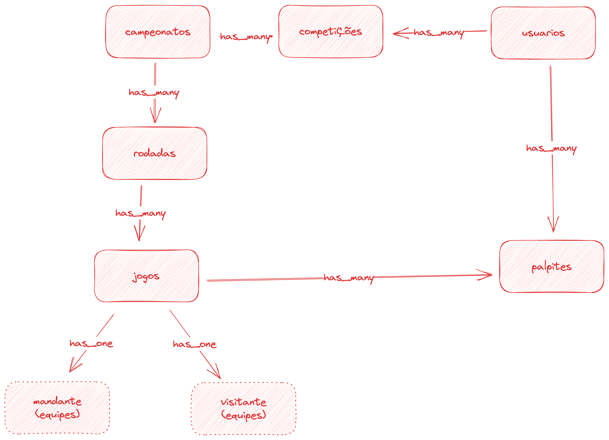

# setup do projeto

## criação do sistema de administração do bolão

Esta primeira fase, vamos criar o setup básico do app. Vamos continuar fazendo o que já conhecemos: inicialização do projeto rails e autenticação utilizando o devise. Desta vez, como queremos criar um backoffice para controlar nossa aplicação de forma super rápida, vou utilizar uma gem especialista em fazer aplicações de administração de serviços: o [active admin](https://activeadmin.info/). Segue o roteiro:

```bash
rails new raro-bolao
cd raro-bolao
```

Vamos adicionar as gems necessárias para o funcionamento do projeto, nesta primeira fase. Abra o arquivo `Gemfile` e adicione as seguintes gems:

```ruby
# Gemfile

gem 'sass-rails'
gem 'devise'
gem 'activeadmin'

group :development, :test do
  gem 'faker'
  gem 'rspec-rails'
  gem 'shoulda-matchers'
  # ...
```

```bash
bundle install

# inicializa o rspec como engine de testes do app.
rails generate rspec:install
# dado que estamos alterando nosso sistema para o rspec, vamos remover o test_unit
rm -rf test
# inicializa o active admin. o Argumento `Usuario` é alternativo, mas preferi utiliza-lo, para preservar o nome dos modelos todos em português.
rails generate active_admin:install Usuario
rails db:migrate
rails db:seed
rails server
```

ao visitar o endereço `http://localhost:3000/admin`, você já terá acesso ao painel administrativo. O usuário base é

```
User: admin@example.com
Password: password
```

Neste momento, todos os usuários de nossa aplicação são também usuários administradores deste sistema. Daqui a pouco melhoramos isto.

## Criando modelos

Antes de dar sequência, podemos notar que nosso modelo de Usuário está criado, mas ainda não testado. O comando `rspec` nos mostra isso. Vamos adicionar alguns testes de spec para ele.

```ruby
# spec/models/usuario_spec.rb
require 'rails_helper'
require 'faker'

RSpec.describe Usuario, type: :model do
  it { should_not be_valid }

  context "criacao do usuario" do
    it "email e senha são obrigatórios" do
      usuario = Usuario.new email: Faker::Internet.email, password: Faker::Internet.password
      expect(usuario).to be_valid
    end

    it "valida formato de email" do
      usuario = Usuario.new email: Faker::Name.name, password: Faker::Internet.password
      expect(usuario).to_not be_valid
    end

    it "valida presença de senha" do
      usuario = Usuario.new email: Faker::Internet.email
      expect(usuario).to_not be_valid
    end
  end
end
```

### migrations

Próximo passo, vamos criar os modelos para o bolão. Nossa primeira versão conta com poucas funcionalidades, então, não teremos muita complexidade na modelagem proposta. Conforme pode ser visto abaixo, nosso projeto será iniciado com uma entidade de `Campeonato`. Esta nos permitirá usar a mesma plataforma para a competição de diversos torneios diferentes em um mesmo ano, e reutiliza-la também nos anos seguintes.

Todos os campeonatos serão organziados por `Rodadas`, onde cada uma possui uma lista de `Jogos`. Cada jogo possui um `Mandante` e um `Visitante`, ambos do tipo `Equipe`. Sim, nossa primeira versão está preparada para lidar com esportes onde temos apenas dois times em campo.



Na sequência, vamos à construção dos modelos.

#### campeonatos

```bash
rails g model Campeonato nome ativo:boolean
rails db:migrate
```

```ruby
# app/models/campeonato.rb
class Campeonato < ApplicationRecord
  validates :nome, presence: true, uniqueness: true
end

# spec/models/campeonato_spec.rb
require 'rails_helper'

RSpec.describe Campeonato, type: :model do
  it { should_not be_valid }
  it { should validate_presence_of(:nome) }
  it { should validate_presence_of(:nome) }
end
```

#### Rodada

```bash
rails g model Rodada nome ativo:boolean campeonato:references
rails db:migrate
```

```ruby
# app/models/campeonato.rb
class Campeonato < ApplicationRecord
  validates :nome, presence: true, uniqueness: true
  # adiciona novo relacionamento em campeonato
  has_many :rodadas
end
```

```ruby
# spec/models/campeonato_spec.rb

# ...
# adicionar uma nova validação no teste do campeonato.
it { should have_many :rodadas }
# ...
```

```ruby
# app/models/rodada.rb
class Rodada < ApplicationRecord
  validates :nome, presence: true
  belongs_to :campeonato
end

# spec/models/rodada_spec.rb
require 'rails_helper'

RSpec.describe Rodada, type: :model do
  it { should_not be_valid }
  it { should validate_presence_of :nome }
  it { should belong_to :campeonato }
end
```

#### Equipes

```bash
rails g model Equipe nome
rails db:migrate
```

```ruby
# app/models/equipe.rb
class Equipe < ApplicationRecord
  validates :nome, presence: true
end

# spec/models/equipe_spec.rb
require 'rails_helper'

RSpec.describe Equipe, type: :model do
  it { should_not be_valid }
  it { should validate_presence_of :nome }
end
```

#### Jogos

```bash
rails g model Jogo mandante:references visitante:references gols_mandante:integer gols_visitante:integer rodada:references data_hora:datetime
```

Podemos notar que a criação do modelo de jogos tem uma particularidade: ele cria os campos `mandante` e `visitante` do tipo referência. Dado que não temos modelos com estes nomes, precisaremos informar ao RoR as entidades referenciada. Abra o arquivo responsável pela migration de jogos. Precisamos informar a entidade que `mandante` e `visitante` referenciam.

```rb
# db/migrate/..._create_jogos.rb
class CreateJogos < ActiveRecord::Migration[7.0]
  def change
    create_table :jogos do |t|
      t.references :mandante, null: false
      t.references :visitante, null: false
      t.integer :gols_mandante
      t.integer :gols_visitante
      t.references :rodada, null: false, foreign_key: true
      t.datetime :data_hora

      t.timestamps
    end

    add_foreign_key "jogos", "equipes", column: "mandante_id"
    add_foreign_key "jogos", "equipes", column: "visitante_id"
  end
end
```

```bash
rails db:migrate
```

```ruby
# app/models/jogo.rb
class Jogo < ApplicationRecord
  belongs_to :mandante, class_name: 'Equipe'
  belongs_to :visitante, class_name: 'Equipe'
  belongs_to :rodada
end


# spec/models/jogo_spec.rb
require 'rails_helper'

RSpec.describe Jogo, type: :model do
  it { should_not be_valid }

  it { should belong_to(:mandante).class_name('Equipe') }
  it { should belong_to(:visitante).class_name('Equipe') }
  it { should belong_to :rodada }
end

```

#### Palpites

```bash
rails g model Palpite jogo:references usuario:references gols_mandante:integer gols_visitante:integer
rails db:migrate
```

- adiciona `has_many: palpites` em usuário e jogos

```ruby
# app/models/palpite.rb
class Palpite < ApplicationRecord
  validates :gols_mandante, presence: true
  validates :gols_visitante, presence: true

  belongs_to :jogo
  belongs_to :usuario
end

# spec/models/palpite_spec.rb
require 'rails_helper'

RSpec.describe Palpite, type: :model do
  it { should belong_to :jogo }
  it { should belong_to :usuario }
  it { should validate_presence_of :gols_mandante }
  it { should validate_presence_of :gols_visitante }
end
```

### competições

Esta entidade é a representação a associação de nosso usuário com os campeonatos que ele participa.

```bash
rails g model Competicao usuario:references campeonato:references
rails db:migrate
```

```ruby
# app/models/competicao.rb
class Competicao < ApplicationRecord
  belongs_to :usuario
  belongs_to :campeonato
end

# app/models/usuario.rb
# ...
# em usuários, dizemos que um usuário tem muitos campeonatos, passando pela relação de competições
has_many :competicoes
has_many :campeonatos, through: :competicoes, source: :campeonato
# ...

# app/models/campeonato.rb
# ...
# O mesmo em campeonato, onde dizemos que eles possuem diversos competidores
has_many :competicoes
has_many :competidores, through: :competicoes, source: :usuario
# ...
```

## Criando os resources do active admin

Uma vez que nossas entidades já estão criadas, podemos criar os `resources` do active admin. Um resource representa uma entidade a ser administrada pelo active admin. Para começarmos, vamos criar o resource de `campeonatos`

```bash
rails g active_admin:resource Campeonato
```

Este comando inicia o arquivo `app/admin/campeonatos.rb`. Neste arquivo, podemos configurar, através de uma linguagem em [dsl](https://pt.wikipedia.org/wiki/Linguagem_de_dom%C3%ADnio_espec%C3%ADfico), todo o comportamento do crud de administração dos nossos campeonatos. Esta ferramenta é extremamente útil para a nossa situação, onde queremos criar um sistema de administração de forma rápida e sem muito esforço.

```ruby
# app/admin/campeonatos.rb
ActiveAdmin.register Campeonato do
  scope :all, default: true
  scope :ativos

  filter :nome

  permit_params :nome, :ativo
end

# app/models/campeonato.rb
# adicionei o escopo de ativos
scope :ativos, -> { where ativo: true }
```

Farei o mesmo processo, de criação do resource, possíveis alterações dos modelos e testes para os demais resources que fazem sentido para nosso sistema. Os passos que se diferenciarem um pouco, citarei em detalhes. De toda forma, caso queria acompanhar o progresso do projeto, sugiro que utilize o histórico de commits para isso.

```bash
rails g active_admin:resource Equipe
rails g active_admin:resource Rodada
```
